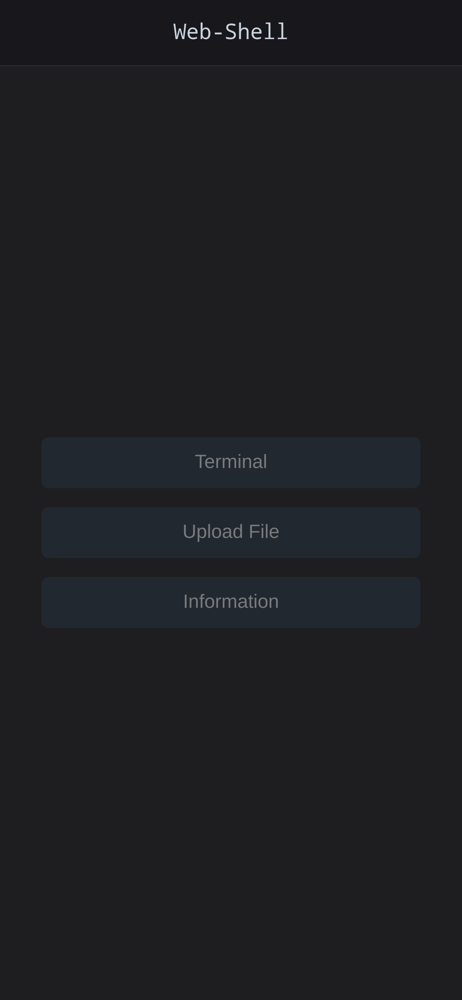
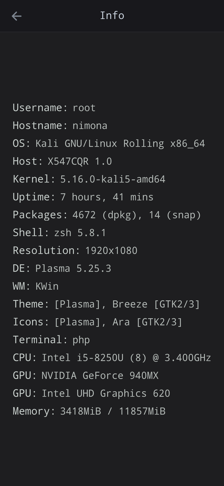
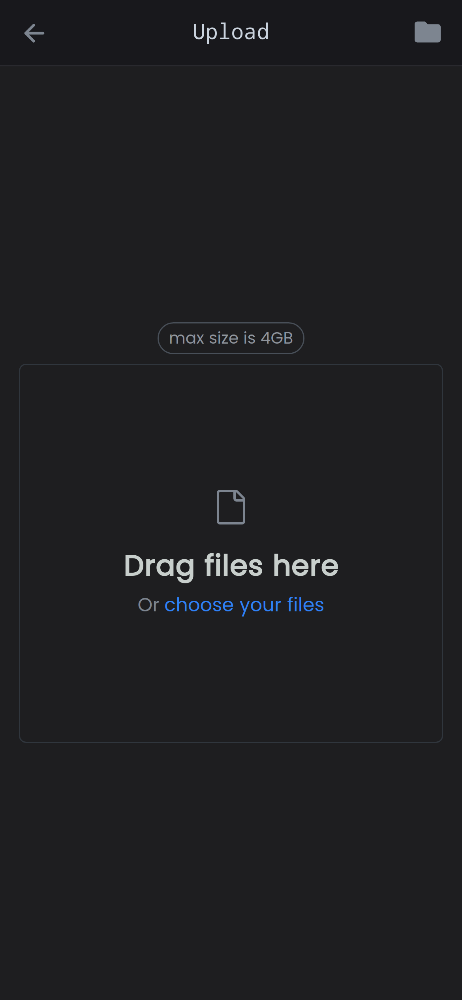
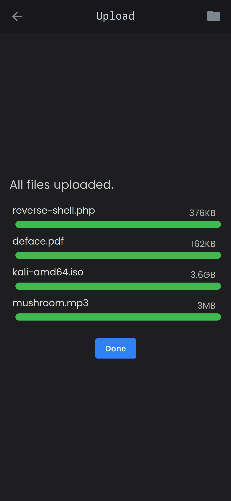

# Web-Shell

This is a **web-shell** with php

You can run system commands and upload files to the server.

## How to test it?

Go to the `web-shell` folder and run php localhost:

<!--
```bash
php -S $(ifconfig | grep "inet " | grep -v 127.0.0.1 | cut -d ' ' -f10):6060
```
-->

```bash
php -S localhost:6060
```

then open the following url
```
http://localhost:6060/shell.php
```

## Preview


<table>
  <tr>
    <td>
      
    </td>
    <td>
      
    </td>
  </tr>
  <tr>
    <td>
      
    </td>
    <td>
      
    </td>
  </tr>
</table>